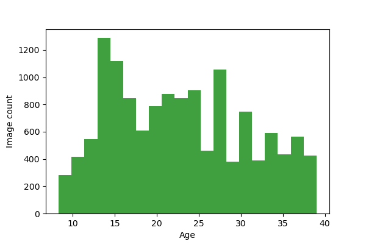

# selfie-fv
*A dataset for age estimation*

Can we learn to estimate the age of a face using not the raw image but just an face vector (embedding designed for facial recognition)?

## The Data
The data folder has face embeddings (face vectors) with accurate age ground-truth, split 80/20 into [selfie_train.pkl](data/selfie_train.pkl) and [selfie_test.pkl](data/selfie_test.pkl) (pickled Pandas DataFrame objects).  Currently, we've got a total of 21,070 images - all female.

## Methodology
The dataset was prepared by collecting selfies published by [celebrities with known dates of birth](https://www.famousbirthdays.com/) and embedding them using an [open-source version of FaceNet](https://github.com/davidsandberg/facenet).